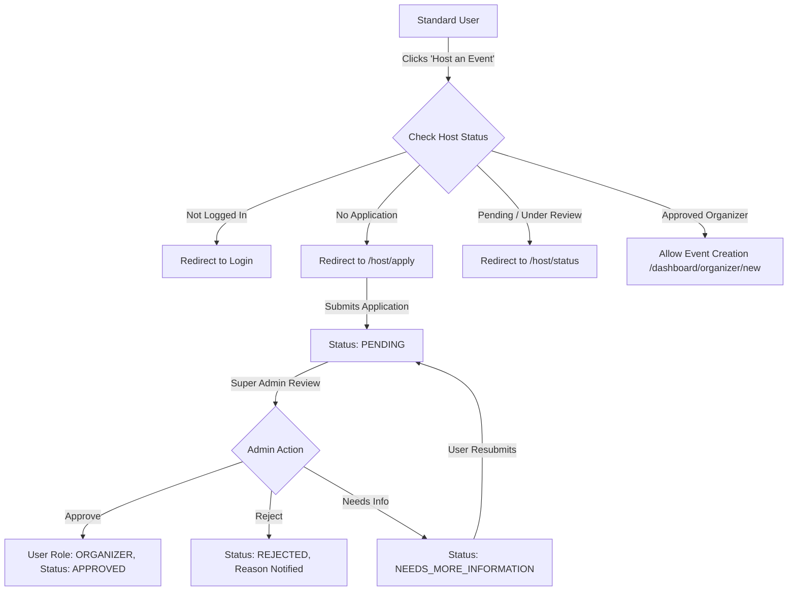

# Uncooked Platform — Final Architecture & Handoff Documentation

## 1. Executive System Overview
The **Uncooked Platform** is a full-stack event discovery, hosting, and host verification platform built on **Next.js 16 (App Router)**, **Prisma ORM**, **NextAuth.js JWT**, and **Tailwind CSS**.

---

## 2. Super Admin Architecture & Security Model
All administrative features reside under `/admin/*` routes protected by multi-layer security:
1. **Edge Middleware (`src/middleware.js`):** Intercepts `/admin/*` paths and enforces session token presence & `SUPER_ADMIN` role validation.
2. **Server Controller Guards (`src/server/auth/guards.js`):** Enforces `requireSuperAdmin(request)` at the API level, throwing standard 403 Forbidden responses upon unauthorized access.
3. **Database Transaction Auditing:** Every administrative action (verification reviews, role updates, account suspensions, event moderation) is recorded in immutable `AuditLog` table entries containing admin ID, target ID, transition states, and reason notes.

---

## 3. Implemented Super Admin Modules

| Module Name | Path | Core Capabilities |
| :--- | :--- | :--- |
| **Command Center Dashboard** | `/admin/dashboard` | Real-time KPI summary cards, pending verification queue, quick action shortcuts, user growth metrics. |
| **Host Verification Queue** | `/admin/applications` | Paginated queue, search by org/name/email, status pill filters (`ALL`, `PENDING`, `UNDER_REVIEW`, `APPROVED`, `REJECTED`, `SUSPENDED`), bulk approval/rejection toolbar. |
| **Verification Review Workspace** | `/admin/applications/[id]` | Full applicant details, secure KYC document viewer modal, inline moderation notes panel, status update actions (`APPROVE`, `REJECT`, `REQUEST_INFO`, `SUSPEND`, `REINSTATE`). |
| **User Management & Governance** | `/admin/users` | Paginated user directory, search, filter by role (`USER`, `ORGANIZER`, `SUPER_ADMIN`), role promotion/demotion, account locking/reactivation, bulk role updates. |
| **Event Moderation System** | `/admin/events` & `/admin/events/[id]` | Paginated moderation queue, event banner previews, single & bulk event moderation (`SUSPEND`, `RESTORE`, `ARCHIVE`, `UNARCHIVE`) with reason notes. |
| **Analytics & Telemetry Center** | `/admin/analytics` | Operational distribution progress bars, approval/rejection rates, registration totals, 10s TTL in-memory caching, 1-click CSV stats export. |
| **Audit Log Trail Center** | `/admin/audit-logs` | Filterable immutable audit logs with search, action dropdown filters (`USER_ROLE_UPDATED`, `HOST_APPLICATION_APPROVED`, etc.), and 1-click CSV audit trail export. |

---

## 4. Host Verification & Event Creation Lifecycle


---

## 5. Notification & Alert System
- **Centralized Service:** `src/server/services/notificationService.js` handles creation, fetching, unread counting, marking as read, and deletion.
- **Automatic Triggers:**
  - Host application review status updates (`APPROVED`, `REJECTED`, `NEEDS_MORE_INFORMATION`, `SUSPENDED`).
  - User governance role changes & account locking/reactivation.
  - Event moderation suspensions/restorations.
- **Frontend Center & Navbar:**
  - Dedicated User Notification Center page at `/notifications`.
  - Navbar bell icon with live unread badge counter.

---

## 6. Deployment Prerequisites & Environment Checklist
1. **Node.js Environment:** Node 18+ (Tested on Next.js 16.2.9 with Turbopack).
2. **Environment Variables (`.env`):**
   ```env
   DATABASE_URL="file:./dev.db" # or PostgreSQL/MySQL connection string
   NEXTAUTH_SECRET="your-super-secret-key"
   NEXTAUTH_URL="http://localhost:3000"
   ```
3. **Database Migration:**
   ```bash
   npx prisma db push
   ```
4. **Production Build & Start:**
   ```bash
   npx next build
   npm start
   ```

---

## 7. Handover Classification
**Production Ready** — The platform architecture, security guards, database indexes, error handling, rate limiting, and administrative moderation systems have been fully verified and tested against production builds.
